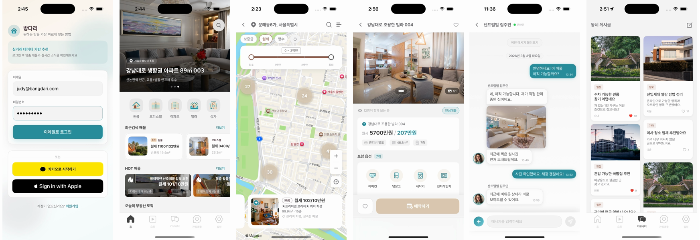

# 방다리 (Bangdari)

  
   
   
  <b>방다리</b>는 집주인과 소비자를 직접 연결하는 부동산 직거래 iOS 앱입니다.
   
   
  중개수수료 없이, 탐색부터 채팅, 예약, 결제까지 한 앱에서

  
  
  

  

## 프로젝트 개요

중개사 없이 집주인이 직접 매물을 올리고, 소비자는 지도 탐색부터 방문 예약과 계약금 결제까지 한 앱 안에서 진행하는 직거래 구조의 iOS 앱이다. 매물 신뢰 정보(본인 인증, 응답률)를 화면에 직접 노출해 소비자가 집주인을 검증하며 거래할 수 있도록 설계했다.

- **개발 기간**: 2025.12 - 2026.02 (3개월)
- **역할**: iOS 단독 개발
- **배포 타겟**: iOS 18.0+
- **GitHub**: [Bangdari-SwiftUI](https://github.com/pyoram25/Bangdari-SwiftUI)

## 주요 기능

- 🗺️ **지도/리스트 매물 탐색** — 가시 영역 기반 동적 로딩 + 클러스터링으로 위치 탐색
- 🏠 **집주인 직거래 채팅** — Socket.IO 기반 실시간 1:1 채팅
- 📅 **방문 예약** — 희망 날짜 요청, 승인/거절 흐름
- 💳 **계약금 결제** — 포트원 WebView 결제 + 서버 검증 3단계 파이프라인
- 📋 **매물 등록/관리** — 집주인 직접 등록, 예약 승인, 결제 상태 확인
- 🔐 **소셜 로그인** — Sign in with Apple, Kakao 로그인 + JWT Keychain 세션

## 기술 스택

| 분류 | 기술 |
|------|------|
| UI / Presentation | SwiftUI, UIKit, WebKit, MapKit, AVKit |
| Architecture | MVVM, Clean Architecture, DIContainer, Repository Pattern |
| Reactive & State | Combine, Intent 기반 상태 관리 |
| Networking | URLSession, REST API, Socket.IO, Multipart/Form-Data |
| Auth / Security | JWT, KeychainManager, Sign in with Apple, Kakao Login |
| Payment | iamport iOS SDK, KG이니시스 |
| Image / Map | Kingfisher, CoreLocation, MapKit |
| Dependency | Swift Package Manager |

## 핵심 구현

### 1. 주문 생성부터 서버 검증까지 이어지는 결제 파이프라인

PG사 결제창은 네트워크 지연이나 앱 전환으로 결제가 완료됐음에도 실패 신호가 올 수 있어, 클라이언트 판단만으로 결제를 확정하면 이중 청구, 누락 위험이 있었다. 주문 생성 → WebView 결제 → 서버 검증 3단계로 흐름을 분리하고, 실패 콜백에서도 `imp_uid`가 존재하면 서버 검증을 재시도하는 방어 로직으로 클라이언트 오판을 원천 차단했다.

`iamport iOS SDK` `UIViewRepresentable` `NotificationCenter` `서버 검증`

---

### 2. 동시 요청 상황에서 토큰 갱신을 한 번만 실행하는 구조

탭 진입 시 여러 요청이 동시에 나가는 구조에서 AccessToken이 만료되면 각 요청이 독립적으로 갱신을 시도해 RefreshToken이 서버에서 무효화될 위험이 있었다. `NSLock` 기반 `isRefreshing` 플래그와 `[CheckedContinuation<Void, Never>]` 큐를 조합해 갱신을 1회만 실행하고, 대기 중인 요청은 갱신 완료 후 자동 재개되도록 설계했다.

`NSLock` `CheckedContinuation` `URLSession Interceptor` `강제 로그아웃`

---

### 3. 타입과 키 이름이 일정하지 않은 서버 응답 안정적으로 처리하기

실서버에서 보증금이 `Int`, `Double`, 문자열로 섞여 오거나, 타임스탬프 키가 `created_at`/`createdAt` 중 하나로 달라지는 등 기본 `JSONDecoder`로는 전체 파싱이 실패해 화면이 통째로 깨지는 문제가 있었다. 커스텀 `init(from decoder:)` 내에서 타입, 키 우선순위 폴백 전략을 적용해, 어떤 형태로 오든 파싱 실패 크래시 없이 화면이 일관된 상태를 유지하도록 했다.

`Codable` `Custom Decoding` `타입 폴백` `키 폴백`

---

## 개발자

|  |
|:---:|
| [Piri(김소람)](https://github.com/piriram) |
| iOS 개발 |

## License

MIT License
